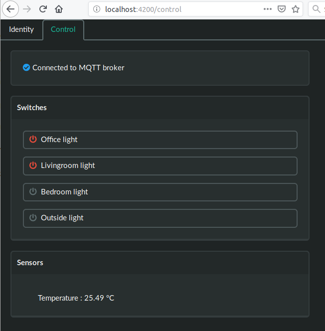

# Otto

Otto is a simple web application to control switches using MQTT. Connection setttings are configured through the web
interface, and stored in the browser's [local storage](https://developer.mozilla.org/en-US/docs/Web/API/Web_Storage_API).

## Development server

Run `make up logs` to bring otto up and point a browser to http://localhost:4200/

## Build the Docker image

Run `docker build`

Requirements:

* [MQTT server with websockets enabled](http://www.steves-internet-guide.com/mqtt-websockets/)
* A [yaml file describing the devices to control](./src/assets/devices.yaml). This should be available over HTTP(s) somewhere
* Some sort of service that controls the switches (see switch topics below)

## Switch Topics

Base topics are configured in the YAML file, but the messages are expected to follow a specific format. For example, assume the base MQTT topic for device is `homeassistant/switch/sprinkler`:

* Clicking on the web interface button to turn the sprinkler on will send a message on topic `homeassistant/switch/sprinkler/set` with a value of "ON"
* Once the sprinkler has been turned on, whatever is controlling it is expected to set `homeassistant/switch/sprinkler/state` to `ON` and set the retain flag on that message

Likewise for turning our example sprinkler off.

This use of "set" and "state" messages is compatible with [Home Assistant](https://www.home-assistant.io/components/switch.mqtt/) among others.

## Development server

Run `make up logs` to bring otto up and point a browser to http://localhost:4200/

## Build the Docker image

Run `docker build`
